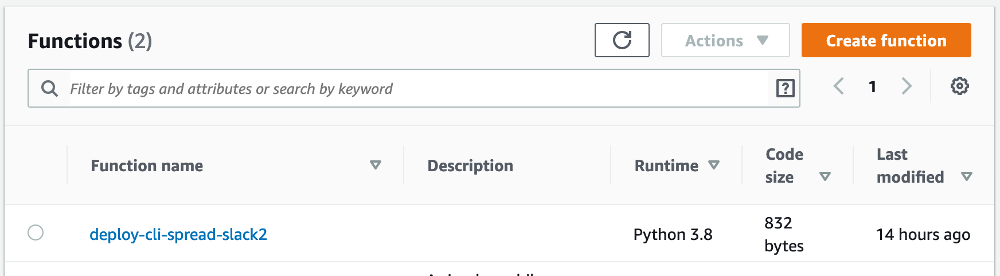

## Summary

Deploy the template script as a Lambda function automatically  
which can read/write Google spreadsheet and post to Slack.

Post to Slack the number of rows in a given spreadsheet.


You can add some Python code and modify the contents of post.

## Prerequisite

- AWS account (Docs: [how to account](https://aws.amazon.com/premiumsupport/knowledge-center/create-and-activate-aws-account/), [how to start securely](https://docs.aws.amazon.com/IAM/latest/UserGuide/getting-started_create-admin-group.html))
- macOS (develop at 10.14.6)
- install python3 (develop at 3.8.1)
- aws-cli v2 (develop at 2.0.40) (Docs: [how to install](https://docs.aws.amazon.com/cli/latest/userguide/install-cliv2-mac.html))
- Configure aws-cli; have a profile (Docs: [how to configure](https://docs.aws.amazon.com/cli/latest/userguide/cli-configure-quickstart.html))
- Create a role for AWS Lambda (Docs: [how to create](https://docs.aws.amazon.com/lambda/latest/dg/lambda-intro-execution-role.html))
- Create a Slack app (know Bot User OAuth Access Token) (Docs: [how to](https://slack.com/help/articles/115005265703-Create-a-bot-for-your-workspace))
- Greate a service account in GCP console and share your spreadsheet with the service account (Docs: [how to](https://gspread.readthedocs.io/en/latest/oauth2.html#for-bots-using-service-account))

## Usage

```
git clone https://github.com/ftnext/python-as-pyconjp-staff.git
cd python-as-pyconjp-staff/cli_boilerplate/spread_slack_lambda/

./deploy.sh \
  -n deploy-cli-spread-slack \  # Name of your Lambda function
  -r 'arn:aws:iam::xxx:role/my-lambda-role' \  # A role for AWS Lambda
  -t 'xoxb-spam-yyyy' \  # Slack Bot User OAuth Access Token
  -s 'ham_zzz' \  # Target spreadsheet id
  -- \
  --profile my-profile \  # Your profile
  --region ap-northeast-1  # AWS region
```

## Result

The deploy.sh creates a Lambda function.



The Python code has been uploaded, so you can edit on your browser.


The parameters specified in the command line is set to the environment variables.


If you have not needed Lambda layers, the script creates them.


## 2 step needed to invoke the function.

Set the contents of your service account file to the environment variable `SERVICE_ACCOUNT_CONTENTS`.

1. Run the python script

```
python3 ../../tools/oneliner_credential.py service_account_file.json output_oneliner.json
```

2. Copy the contents of `output_oneliner.json` (which is a oneliner string), then paste it as a value of `SERVICE_ACCOUNT_CONTENTS`.

## Invoke

```
aws lambda invoke \
  --function-name deploy-cli-spread-slack \
  out \  # Return value of the function is written in this file
  --log-type Tail \
  --query 'LogResult' \
  --output text \
  --profile my-profile \
  --region ap-northeast-1 \
  | base64 -D  # Log is displayed in your command line
```


